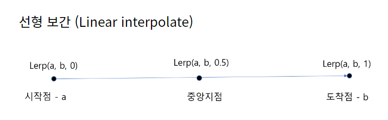
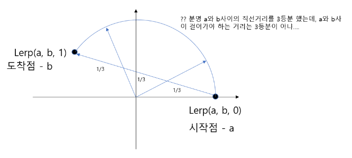
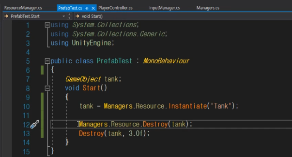
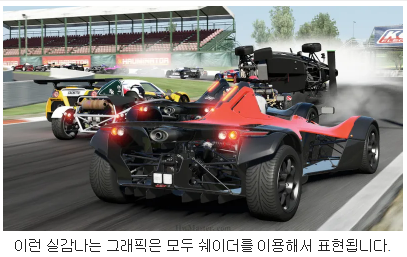
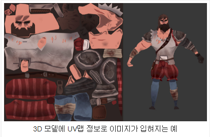
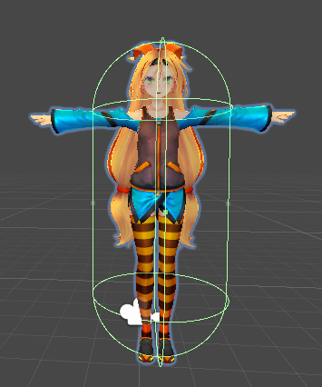
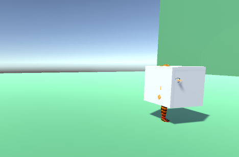
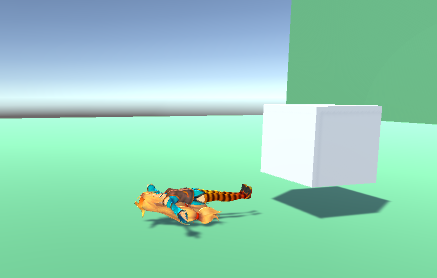

# Chapter 2

### Singleton 패턴

싱글턴 패턴은 인스턴스가 오직 1개만 생성되야 하는 경우에 사용되는 패턴이다.
예를들어 레지스트리 같은 설정 파일의 경우 객체가 여러개 생성되면 설정 값이 변경될 위험이 생길 수 있다.
인스턴스가 1개만 생성되는 특징을 가진 싱글턴 패턴을 이용하면, 하나의 인스턴스를 메모리에 등록해서 여러 스레드가 동시에 해당 인스턴스를 공유하여 사용하게끔 할 수 있으므로, 요청이 많은 곳에서 사용하면 효율을 높일 수 있다.
주의 해야할 점은 싱글턴을 만들때 동시성(Concurrency) 문제를 고려해서 싱글턴을 설계해야 한다.

### Component 패턴

상속과 컴포넌트 비교 추가하기

<br>

# Chapter 3

### 변수를 Unity 에디터에서 조정 가능하게 하기

```csharp

// private으로 선언하면 에디터에서 조정할 수 없다
float _speed = 10.0f;

// public으로 선언하면 에디터에서 조정할 수 있다
public float _speed = 10.0f;

// public으로 외부에 노출하고 싶지 않은 변수라면 [SerializeField] Attibute를 달아주면 된다
[SerializedField]
float _speed = 10.0f;

```

### Position

유니티에는 World 좌표와 Local 좌표가 있다. World 좌표는 게임 세계의 절대좌표이고 Local 좌표는 게임 캐릭터가 바라보는 방향을 기준으로 하는 상대 좌표이다.

- Local 좌표를 World 좌표로 변환할 때는 `transform.TransformDirection`를 사용
- World 좌표를 Local 좌표로 변환할 때는 `transform.InverseTransformDirection`를 사용
- `transform.Translate`를 사용해도 Local 좌표를 World 좌표로 변환해준다
- 게임수학을 공부해서 행렬을 이용해서 좌표계산을 할 수도 있음

```csharp

// 캐릭터가 바라보는 Local 좌표를 World 좌표로 변환
// 캐릭터가 바라보는 방향으로 직진하게 된다
transform.position += transform.TransformDirection(Vector3(0.0f, 0.0f, 1.0f) * Time.deltaTime * _speed)

transform.position += transform.TransformDirection(Vector3.forward * Time.deltaTime * _speed)

transform.Translate(Vector3.forward * Time.deltaTime * _speed);

// 모두 같은 동작을 하는 코드임
// Time.deltaTime 이전 프레임과 현재 프레임의 시간 간격을 의미. 너무 빠르게 움직이는걸 방지하기 위해 곱해줌

```

### 캐릭터가 너무 빠르게 움직일 때

Update문은 한 Frame당 호출되는 함수이다. 게임이 60 Frame이라면 1/60초 마다 Update 함수가 실행되므로 캐릭터가 너무 빠르게 이동할 수 있다. 그래서 이전 프레임과 현재 프레임의 시간 차이를 구하고 그걸 활요해서 이동속도를 조절해야 한다. 위 코드에서 `Time.deltaTime`은 이전 프레임과 현재 프레임의 시간 간격을 의미한다. 너무 빠르게 움직이는걸 방지하기 위해 `Vector3.forward * Time.deltaTime` 와 같이 곱해주었다.

<br>

## Vector

Vector는 float x, y, z를 들고있는 간단한 구조체이다. 사용하는 방법에 따라 위치벡터, 방향벡터로 나뉘게 된다.

### 위치벡터

### 방향벡터

방향 벡터에는 **거리(크기)**와 실제 **방향**에 대한 정보가 담겨 있다.
magnitude를 사용해서 크기를, normalized를 사용해서 방향은 같고 크기가 1인 벡터를 구할 수 있다. normalized를 이용하면 시간 \* 속력을 곱해서 원하는 방향으로 이동을 쉽게 구현할 수 있다.

### Vector3 구조체(struct)를 이해하기 위한 실습

struct를 사용하면 Value Type을 만든다. Value Type은 상속될 수 없고 데이터를 복사하여 파라미터를 전달하는 특징이 있다.(Reference Type은 Heap 상의 객체에 대한 레퍼런스를 전달한다)

```csharp
struct MyVector
{
    public float x;
    public float y;
    public float z;

    // 거리 구할때 magnitude 사용
    public float magnitude
    {
        get { return  Mathf.Sqrt(x*x + y*y + z*z); }  // 피타고라스 정리 활용
    }

    // magnitude와 방향은 같고 크기가 1인 벡터
    // normalized에 거리만큼의 크기를 곱해주면 그 방향으로 크기만큼 이동
    public MyVector normalized
    {
        get { return new MyVector(x / magnitude, y / magnitude, z / magnitude); }
    }

    public MyVector(float x, float y, float z)
    {
        this.x = x;
        this.y = y;
        this.z = z;
    }

    // MyVector간의 연산을 위해 operator 정의
    public static MyVector operator +(MyVector a, MyVector b)
    {
        return new MyVector(a.x + b.x, a.y + b.y, a.z + b.z);
    }
    public static MyVector operator -(MyVector a, MyVector b)
    {
        return new MyVector(a.x - b.x, a.y - b.y, a.z - b.z);
    }

    public static MyVector operator *(MyVector a, float d)
    {
        return new MyVector(a.x * d, a.y * d, a.z * d);
    }
}

public class PlayerController : MonoBehaviour
{
    [SerializeField]
    float _speed = 10.0f;

    void Start()
    {
        MyVector to = new MyVector(10.0f, 0.0f, 0.0f);  // 목적지
        MyVector from = new MyVector(5.0f, 0.0f, 0.0f);  // 현재위치
        MyVector dir = to - from;  // (5.0f, 0.0f, 0.0f)

        MyVector normalizedDir = dir.normalized;  // (1.0f, 0.0f, 0.0f)

        MyVector newPos = from + normalizedDir * _speed;
    }

    void Update()
    {
        // ...
    }

}

```

## Rotation

## 오일러(Euler)와 쿼터니언(Quaternion)

#### 오일러

오일러 앵글은 설정되어 있는 순서로 해당 축들을 개별적으로 계산한다.
Unity에서는 X, Y, Z 순서로 오일러 앵글이 계산된다.
세 개의 축을 독립적으로 계산하기 때문에 두 축이 겹쳐버리는 현상이 생기기도 하는데 이를 `짐벌락(Gimbal-lock)`이라고 한다. 이렇게 축이 겹쳐버리면 한 축에 대해서는 계산이 불가능해진다.

### 쿼터니언

설명 추가할것

### eulerAngles

절대 회전값을 지정해서 회전시키는 방법

```csharp
_yAngle += Time.deltaTime * 100.0f;
transform.eulerAngles = new Vector(0.0f, _yAngle, 0.0f);
```

- eulerAngles는 3개 요소를 한번에 다 넣어주도록 문서에 명시되어 있음.
- (0.0f, Time.deltaTime \* 100.0f, 0.0f) 처럼 쓰면 increase를 하면 에러날수 있음

### Roatate

+- delta 값을 특정 축을 중심으로 회전시키는 방법

```csharp
// Rotate에 Vector 값을 넣어줌
transform.Rotate(new Vector3(0.0f, Time.deltaTime * 100.0f, 0.0f));

// Quaternion.Euler는 벡터를 입력하면 Quaternion으로 변환해줌
transform.rotation =  Quaternion.Euler(new Vector3(0.0f, _yAngle, 0.0f));

```

### LookRotation

캐릭터가 바라보는 방향을 바꿔줌

```csharp
// 캐릭터가 월드 좌표 기준으로 forward를 바라봄
transform.rotation = Quaternion.LookRotation(Vector3.forward)
```

### Lerp



### Slerp

캐릭터가 바라보는 방향을 부드럽게 전환할때 사용한다. 두 지점 사이의 구면 선형 보간을 t(마지막 파라미터)에 의해서 계산한 후 위치를 반환한다.



```csharp
// Quaternion Slerp(Quaternion a, Quaternion b, float t);
// 마지막 파라미터를 0.0f로 주면 a에서 움직이지 않고, 1.0f로 주면 b로 바로 회전한다. transform.rotation = Quaternion.LookRotation(Vector3.forward) 한것과 같은 동작임
transform.rotation = Quaternion.Slerp(transform.rotation, Quaternion.LookRotation(Vector3.forward), 0.1f);

```

# Chapter 4

## Prefab(Pre-Fabrication)

프리팹은 여러 컴포넌트들로 미리 구성해 놓은 게임 오브젝트이다. Scene에 새로운 프리팹 인스턴스를 만들기 위한 템플릿 역할을 한다. 프리팹을 활용하여 게임 오브젝트를 생성, 설정 및 저장할 수 있으며 프리팹 에셋에 대한 모든 변경 사항은 해당 프리팹 인스턴스에 자동으로 반영된다. 생성된 프리팹 인스턴스는 서로 독립적으로 동작하며 프리팹 인스턴스를 수정해도 다른 프리팹 인스턴스에는 영향을 주지 않는다.

게임 오브젝트(Game Object)는 월드상에 존재하며, 프리팹은 Asset 폴더에 데이터로 존재한다. 프리팹을 기반으로 인스턴스를 생성하면 런타입 시점에 월드 상의 게임 오브젝트로 존재하게 된다.

### Instance overrides

인스턴스 오버라이드(Instance overrides) 를 이용하면 프리팹 인스턴스 간에 배리에이션을 만들고 인스턴스를 동일한 프리팹 에셋에 연결할 수 있다. 프리팹 에셋을 수정하면 변경된 사항이 모든 인스턴스에 반영되지만 개별 인스턴스를 직접 수정할 수도 있다. 이렇게 하면 해당 인스턴스에 인스턴스 오버라이드가 생성된다. 예를들어 Robot 프리팹 에셋에서 속도 프로퍼티 값을 오버라이드 하여 Fast Robot 인스턴스를 만들 수 있다. Unity Instpector 창에서 인스턴스 오버라이드는 이름 레이블로 굵게 표시되고 왼쪽 여백에 파란색 줄이 난다.

프리팹 인스턴스에는 한계가 있다. 프리팹에 속한 게임 오브젝트의 부모를 변경할 수 없고, 프리팹에 속한 게임 오브젝트는 제거할 수 없다(비활성화는 가능한데 프로퍼티 오버라이드로 간주됨).

#### 🙊 오버라이드 우선권

프리팹 인스턴스의 오버라이드된 프로퍼티 값은 언제나 프리팹 에셋의 값보다 우선권을 가진다. 프리팹 에셋을 변경할 떄 인스턴스의 프로퍼티가 예상대로 변경되지 않으면 해당 프로퍼티가 인스턴스에서 오버라이드 되었는지 확인해야 한다. 인스턴스 오버라이드는 반드시 필요한 경우에만 사용하는게 좋다.(프리펩 에셋에 대한 변경 사항이 모든 인스턴스에 영향을 주는지 파악하기 어렵기 때문)

### Nested Prefab

다른 프리팹 안에 프리팹 인스턴스를 넣을 수 있는 기능이다. Nested Prefab은 고유한 프리팹 에셋 링크를 보유하며 다른 프리팹 에셋의 일부를 형성한다.

### Prefab Variants

프리팹 Variants는 프리팹의 사전 정의된 배리에이션 집합이 필요할 때 유용하다. 예를들어 게임 내에서 동일한 기본 GermSlime 프리팹에 기반한 여러 타입의 GermSlime을 만든 후 그 중 일부 GermSlime이 아이템을 운반하거나 다른 속도로 움직이는 등의 효과를 내도록 할 수 있다. 모든 GermSlime이 공유할 기본 액션을 초기 GermSlime 프리팹이 모두 수행하도록 설정 한 후 스크립트에 속도 프로퍼티를 오버라이드 해서 GermSlime이 더 빠르게 움직이도록 한다. 프리팹 배리언트는 다른 프리팹(기본 프리팹이라고 불림)의 프로퍼티를 상속하고, 프리팹 Variants에 적용된 오버라이드는 기본 프리팹의 값보다 더 우선시된다.

## Resource Manager

### Resource Manager 사용법



- Resource Manager 내용과 어떻게 사용했는지 사용 코드 추가하기
- 똑같은 인터페이스를 Wrapping만 한것

### Model Prefab Instance

설명 붙이기

## Animation

모델이 동작하는 방식을 정의하는 파일이다. 걷거나 뛰거나 팔을 휘두르는 모션을 애니메이터가 정의해서 만든다.

## Material

유니티에서 GameObject의 컬러는 Material이 결정한다. Material은 Shaders와 Texture가 합쳐진 에셋으로 오브젝트의 픽셀 컬러를 결정한다.

그림판 같은 도구에서 사용하는 2D는 빛에 대한 영향이 없다는 특징이 있다. 2D는 고유한 Color값이 결정되고 외부 영향에 의해 변경되지 않는다.
하지만 3차원으로 넘어오면 빛이라는 개념이 생겨서 같은 Color라 하더라도 보여지는 각도에 따라 다르게 표현되어야 하는 이슈가 생긴다. 이렇게 3차원에서 빛 영향에 대한 처리를 렌더링(Rendering)이라고 부른다.

렌더링을 효과적으로 처리하기 위해 3D 물체의 표면에 대한 정보를 별도로 관리하는데 이를 Material이라고 한다. 따라서 GameObject의 색깔을 바꾸려면 Material을 찾아야 한다.

### Shaders

Material과 Lighting 정보를 기반으로 픽셀마다 어떤 색상으로 표현할지 계산하는 수식과 알고리즘으로 구성된 스크립트이다. 빛을 처리하는 방법을 의미하며 그래픽을 화려하게 표현할 수 있는 기능이다. 쉐이더는 GPU에서 작동하는 프로그램이기 때문에 쉐이더 프로그래밍이란 말이 더 많이 사용된다. 유니티에서는 가장 일반적이고 성능이 좋은 Standard Shader를 만들어 놓았기 때문에 여러분은 이것을 사용하기만 하면 된다.



### Textures

오브젝트의 표면에 대한 정보를 담고 있는 비트맵 이미지이다. Texture/Atals에서 원하는 부분만 선택적으로 사용할 수 있다(UV Mapping).



텍스쳐를 잘 활용하면 색깔보다 더 실감나는 3D 물체를 표현할 수 있다.

# Chapter 5

## Collider

유니티에서 물리를 적용하기 위해서는 RigidBody Component를 붙여줘야 한다.

아래 4가지 옵션을 자주 사용한다.

- Mass : 질량, 단위는 Kg
- Use Gravity : 중력을 사용할지
- Is Kinematic
- Constraints

새로운것을 배울때 항상 공식 문서를 보는것을 습관화하자.

[공식 문서](https://docs.unity3d.com/ScriptReference/Rigidbody.html)를 보면 Rigidbody가 아래와 같이 설명되어 있다.

```
Control of an object's position through physics simulation.  Adding a Rigidbody component to an object will put its motion under the control of Unity's physics engine. Even without adding any code, a Rigidbody object will be pulled downward by gravity and will react to collisions with incoming objects if the right Collider component is also present.

물리 시물레이션을 통한 object의 위치를 제어.

obejct에 Rigidbody component를 추가하면 obejct의 움직임이 유니티 물리엔진의 컨트롤 하에 놓이게 됩니다. 코드를 추가하지 않고도 Rigidbody obejct는 중력에 의해 아래로 당겨지게 되고, 올바른 Collider component가 있다면 다가오는 objects와의 충돌에 반응합니다
```

Player에 Capsule Collider를 붙여 주면 여러가지 파라미터가 있는데 전부 알 필요는 없다. Edit Collider를 사용해 Player가 충돌하는 범위를 표시해 준다.



충돌할 때 Player 자체를 이용해서 연산하면 되는데 왜 Capsule Collider를 씌워서 충돌 범위를 인식하는지 궁금할 수 있다.

Player는 무수한 삼각형들로 이루어져 있고 정확히 연산하기 위해서는 엄청난 연산량이 필요하게 된다. 실제 게임에서는 Player가 하나만 있는게 아니라 몬스터 몇백마리가 있을 수 있는데 객체마다 미세한 충돌을 판정하면 연산량을 감당할 수 없다. 그래서 대부분 사용하는 방법은 Player의 Mesh를 기준으로 충돌하기 보다는 Capsule을 씌워서 Capsule이 충돌했는지 여부를 판단한다.

FPS 게임처럼 Collider를 부위별로 붙여서 더 정확하게 충돌 여부를 판정해야 하고 RPG 게임 같은 경우는 위와 같이 rough 하게 붙여줘도 괜찮다.

Player가 공중에서 바닥으로 떨어질 때 바닥의 Mesh Collider를 끄면 바닥을 뚫고 아래로 떨어지게 된다. Player만 Collider를 가지고 있으면 되는게 아니라 충돌 대상도 Collider라는 충돌 범위를 가지고 있어야 그 두 Collider를 이용해서 충돌했는지 여부를 판단할 수 있다.

## Kinematic

물리의 적용을 받지 않게 해줌

RigidBody는 유니티 물리를 사용하기 위해서 뿐만 아니라, 충돌 판정을 이용하기 위해서도 사용한다.
Colider와 Colider끼리 부딪혔을 때 일어나는 판정을 이벤트를 받아서 알 수 있으면 그 시점에서 다양한 일들을 할 수 있다.

RigidBody에 Is Kinematic을 켜면 물리의 영향을 받지 않기 때문에 큐브를 뚫고 들어간다.


Is Kinematic을 끄면 물리의 영향을 받아 상자에 부딪히고 넘어지게 된다.


튕겨져 나가는게 마음에 들지 않으면 Freeze Roition을 조정하면 된다.
체크하면 회전을 안하다록 축을 묶는다.

### Collision이 뜨는 조건

1. 나한테 RigidBody가 있어야 한다. (IsKinematic : Off)
2. 나한테 Collider가 있어야 한다. (IsTrigger : Off)
3. 상대한테 Collider가 있어야 한다. (IsTrigger : Off)

```csharp
//Collision 이벤트 발생시 실행
private void OnCollisionEnter(Collision collision)
{
    Debug.Log("Collision!");
}

//Trigger 이벤트 발생시 실행
private void OnTriggerEnter(Collider other)
{
    Debug.Log("Trigger!");

}

```
